## Part 1. Инструмент **ipcalc**

#### 1. Поднять виртуальную машину (далее -- ws1)


#### 1.1. Сети и маски

##### Определить и записать в отчёт:

##### 1) адрес сети _192.167.38.54/13_


##### 2) перевод маски _255.255.255.0_ в префиксную и двоичную запись, _/15_ в обычную и двоичную, _11111111.11111111.11111111.11110000_ в обычную и префиксную


##### 3) минимальный и максимальный хост в сети _12.167.38.4_ при масках: _/8_, _11111111.11111111.00000000.00000000_, _255.255.254.0_ и _/4_


#### 1.2. localhost

##### Определить и записать в отчёт, можно ли обратиться к приложению, работающему на localhost, со следующими IP: _194.34.23.100_, _127.0.0.2_, _127.1.0.1_, _128.0.0.1_


- 194.34.23.100 (не можно)

- 127.0.0.2 (можно)

- 127.1.0.1 (можно)

- 128.0.0.1 (не можно)

#### 1.3. Диапазоны и сегменты сетей

##### Определить и записать в отчёт:

##### 1) какие из перечисленных IP можно использовать в качестве публичного, а какие только в качестве частных: _10.0.0.45_, _134.43.0.2_, _192.168.4.2_, _172.20.250.4_, _172.0.2.1_, _192.172.0.1_, _172.68.0.2_, _172.16.255.255_, _10.10.10.10_, _192.169.168.1_


- 10.0.0.45 (private)

- 134.43.0.2 (public)

- 192.168.4.2 (private)

- 172.20.250.4 (private)

- 172.0.2.1 (public)

- 192.172.0.1 (public)

- 172.68.0.2 (public)

- 172.16.255.255 (private)

- 10.10.10.10 (private)

- 192.169.168.1 (public)

##### 2) какие из перечисленных IP адресов шлюза возможны у сети _10.10.0.0/18_: _10.0.0.1_, _10.10.0.2_, _10.10.10.10_, _10.10.100.1_, _10.10.1.255_


- 10.0.0.1 (да)

- 10.10.0.2 (да)

- 10.10.10.10 (да)

- 10.10.100.1 (нет)

- 10.10.1.255 (да)

## Part 2. Статическая маршрутизация между двумя машинами

`-` Теперь разберёмся, как связать две машины, используя статическую маршрутизацию.

**== Задание ==**

##### 1. Поднять две виртуальные машины (далее -- ws1 и ws2)


##### 1.1.С помощью команды `ip a` посмотреть существующие сетевые интерфейсы


##### 1.2.Описать сетевой интерфейс, соответствующий внутренней сети, на обеих машинах и задать следующие адреса и маски: ws1 - _192.168.100.10_, маска _/16_, ws2 - _172.24.116.8_, маска _/12_


##### 1.3.Выполнить команду `netplan apply` для перезапуска сервиса сети


#### 2.1. Добавление статического маршрута вручную

- Добавить статический маршрут от одной машины до другой и обратно при помощи команды вида `ip r add`
- Пропинговать соединение между машинами


#### 2.2. Добавление статического маршрута с сохранением

- Перезапустить машины

- `sudo reboot`

- Добавить статический маршрут от одной машины до другой с помощью файла _etc/netplan/00-installer-config.yaml_


- Пропинговать соединение между машинами


## Part 3. Утилита **iperf3**

#### 3.1. Скорость соединения

- Перевести и записать в отчёт: 8 Mbps в MB/s, 100 MB/s в Kbps, 1 Gbps в Mbps

1. 8 Mbps -> 1 MB/s
2. 100 MB/s -> 800000 Kbps
3. 1 Gbps -> 1000 Mbps

#### 3.2. Утилита **iperf3**

- Измерить скорость соединения между ws1 и ws2
- В отчёт поместить скрины с вызовом и выводом использованных команд.


## Part 4. Сетевой экран

#### 4.1. Утилита **iptables**

##### Создать файл _/etc/firewall.sh_, имитирующий фаерволл, на ws1 и ws2:

```shell
#!/bin/sh

# Удаление всех правил в таблице "filter" (по-умолчанию).
iptables –F
iptables -X
```

##### Нужно добавить в файл подряд следующие правила:

- 1. на ws1 применить стратегию когда в начале пишется запрещающее правило, а в конце пишется разрешающее правило (это касается пунктов 4 и 5)
- 2. на ws2 применить стратегию когда в начале пишется разрешающее правило, а в конце пишется запрещающее правило (это касается пунктов 4 и 5)
- 3. открыть на машинах доступ для порта 22 (ssh) и порта 80 (http)
- 4. запретить _echo reply_ (машина не должна "пинговаться”, т.е. должна быть блокировка на OUTPUT)
- 5. разрешить _echo reply_ (машина должна "пинговаться")


##### Запустить файлы на обеих машинах командами `chmod +x /etc/firewall.sh` и `/etc/firewall.sh`


- `Правила выполняться сверху-вниз, следовательно, если правило запрета находиться выше оно срабатывает, а правило разрешения находящиеся ниже нет.`

#### 4.2. Утилита **nmap**

- Командой **ping** найти машину, которая не "пингуется", после чего утилитой **nmap** показать, что хост машины запущен
  _Проверка: в выводе nmap должно быть сказано: `Host is up`_
- В отчёт поместить скрины с вызовом и выводом использованных команд **ping** и **nmap**.


<!-- - Сохранить дампы образов виртуальных машин
  **p.s. Ни в коем случае не сохранять дампы в гит!** -->

## Part 5. Статическая маршрутизация сети

Создадим сеть, по следующей схеме

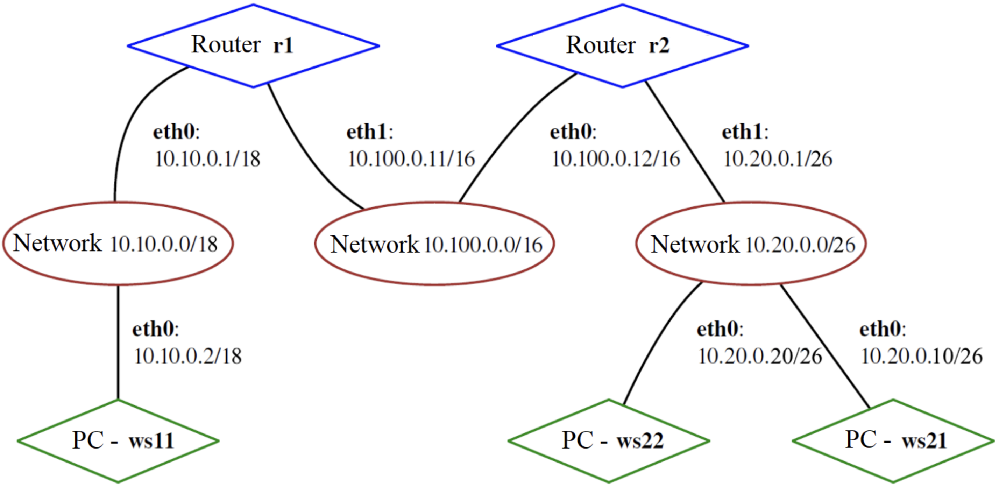

#### 5.0.1 Поднимаем пять виртуальных машин (3 рабочие станции (ws11, ws21, ws22) и 2 роутера (r1, r2)).

Сначала создаём одну виртуальную машину. Потом нажимаем правую клавишу мыши на вновь созданной машине, вибираем _Клонировать..._ и клонируем ещё 4 машины с соответствующими заданию именами (`ws11`, `ws21`, `ws22` и `r1`, `r2`).

Задаём следующие настройки виртуальным машинам:

**1)** Для машины `Router r1` в _Настроить - Сеть_ выставляем:

- _Адаптер_1_ оставляем как есть (_Тип подключения: NAT_);

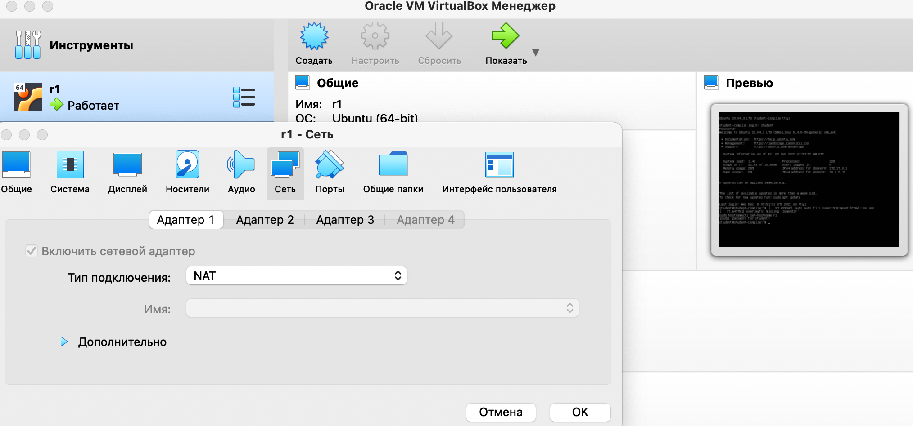

- включаем _Адаптер_2_, выставляем _Тип подключения: Внутренняя сеть_ и устанавливаем имя ` int_net_1`;

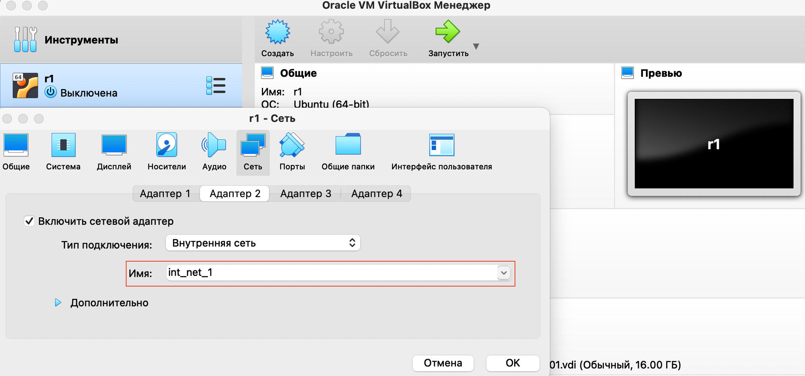

- включаем _Адаптер_3_, выставляем _Тип подключения: Внутренняя сеть_ и устанавливаем имя ` int_net_2`.

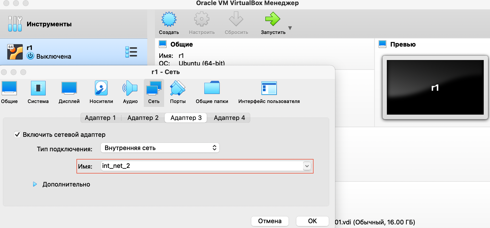

В итоге настройки для `Router r1` должны выглядеть так

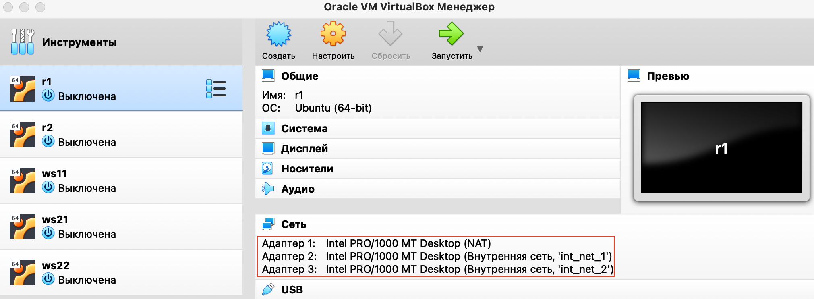

Запускаем `r1` и меняем имя хоста на соотвтетствующее:

> `sudo hostnamectl set-hostname r1`

Перезагружаем машину `r1`.

**2)** Для машины `Router r2`:

- _Адаптер_1_ оставляем как есть (_Тип подключения: NAT_);
- Включаем _Адаптер_2_, выставляем _Тип подключения: Внутренняя сеть_ и устанавливаем имя ` int_net_2`;
- Включаем _Адаптер_3_, выставляем _Тип подключения: Внутренняя сеть_ и устанавливаем имя ` int_net_3`.

В итоге настройки для `Router r2` должны выглядеть так

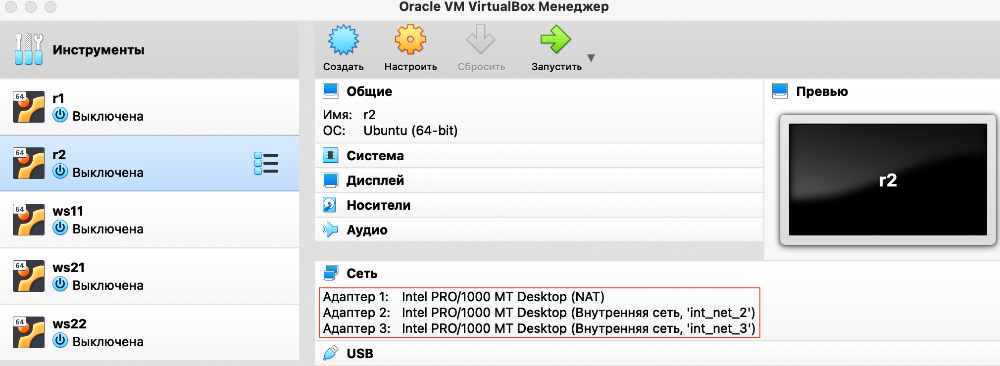

Запускаем `r2` и меняем имя хоста на соотвтетствующее:

> `sudo hostnamectl set-hostname r2`

Перезагружаем машину `r2`.

**3)** Для машины `PC-ws11` в _Настроить - Сеть_:

- _Адаптер_1_ оставляем как есть (_Тип подключения: NAT_);
- включаем _Адаптер_2_, выставляем _Тип подключения: Внутренняя сеть_ и устанавливаем имя ` int_net_1`.

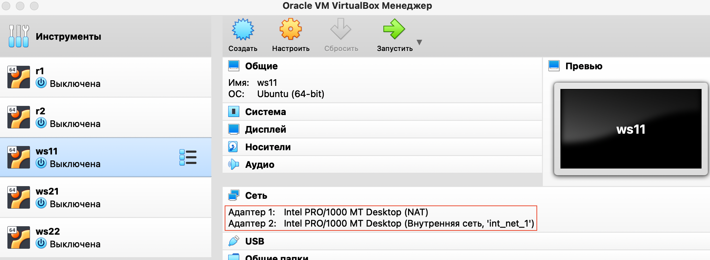

**4)** Для машин `PC-ws21` и `PC-ws22`:

- _Адаптер_1_ оставляем как есть (_Тип подключения: NAT_);
- включаем _Адаптер_2_, выставляем _Тип подключения: Внутренняя сеть_ и устанавливаем имя ` int_net_3`.

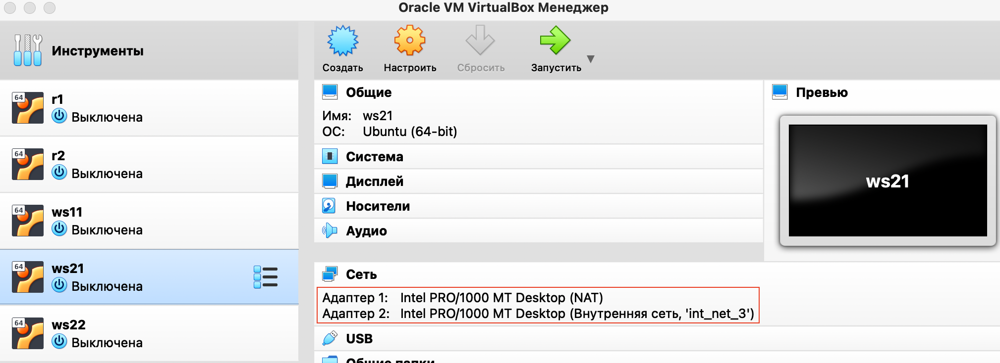

Запускаем все `ws` и меняем на них имя хоста на соотвтетствующее:

- для машины `PC-ws11`

> `sudo hostnamectl set-hostname ws11`

- для машины `PC-ws21`

> `sudo hostnamectl set-hostname ws21`

- для машины `PC-ws22`

> `sudo hostnamectl set-hostname ws22`

Перезагружаем машины `ws11`, `ws21` и `ws22`.

**4)** Для машины `PC-ws11`, `PC-ws21` и `PC-ws22` в _Настроить - Сеть_:

- Адаптер*1 оставляем как есть (*Тип подключения: NAT\_);
- Включаем Адаптер*2 и выставляем *Тип подключения: Внутренняя сеть\_;

Запускаем `PC-ws11` и меняем имя хоста на соотвтетствующее:

- для машины `PC-ws11`

> `sudo hostnamectl set-hostname ws11`

- для машины `PC-ws21`

> `sudo hostnamectl set-hostname ws21`

- для машины `PC-ws22`

> `sudo hostnamectl set-hostname ws22`

Перезагружаем машины `ws11`, `ws21` и `ws22`.

### 5.1. Настройка адресов машин

#### 5.1.1 Настроить конфигурации машин в etc/netplan/00-installer-config.yaml согласно сети на рисунке.

Проверяем какие интерфейсы есть на машине `r1`. И подобным образом можно проверить все остальные машины. На машинах `ws` их будет на 1 меньше.

> `ip a`

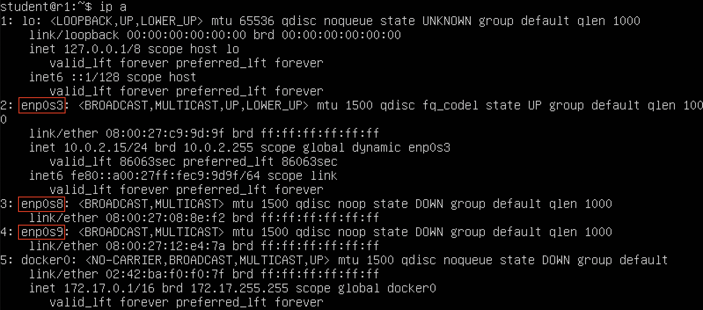

С помощью утилиты `netplan` в файле `etc/netplan/00-installer-config.yaml` прописываем настройки для машин, согласно схемы сети. Используем следующую команду на всех машинах для редактирования адресов.

> `sudo nano /etc/netplan/00-installer-config.yaml`

Красным выделены дописанные части настроек.


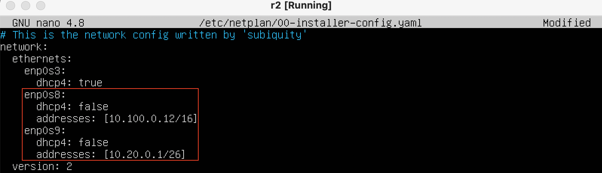
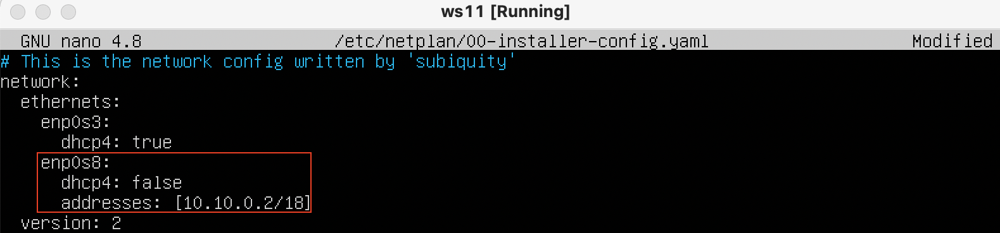
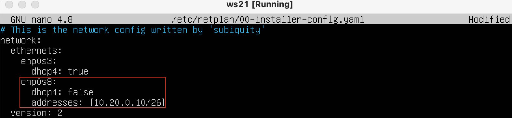
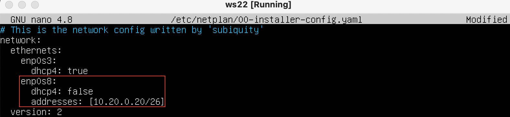

#### 5.1.2 Перезапустить сервис сети и проверить адрес машины

Перезапускаем сервисысети.

> `sudo netplan apply`

Проверим, что адрес машины задан верно.

> `ip -4 a`

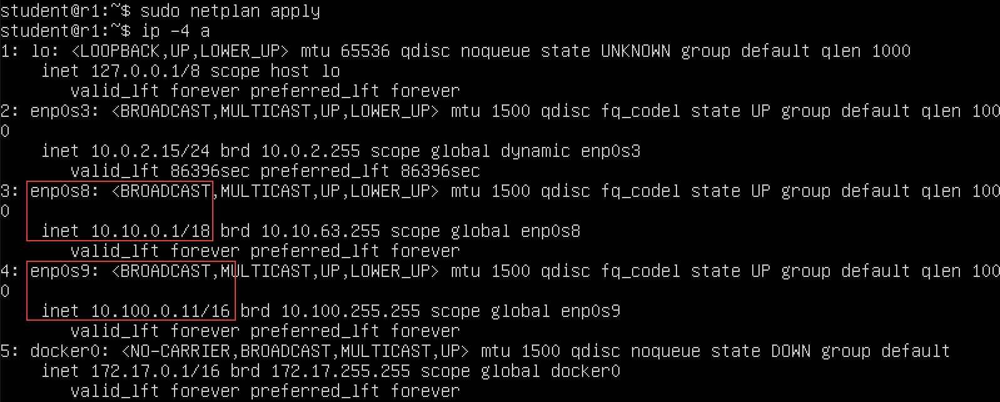
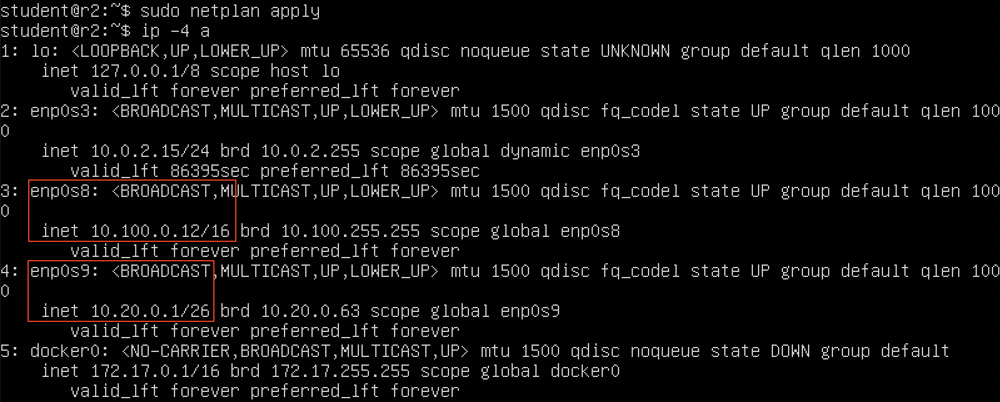
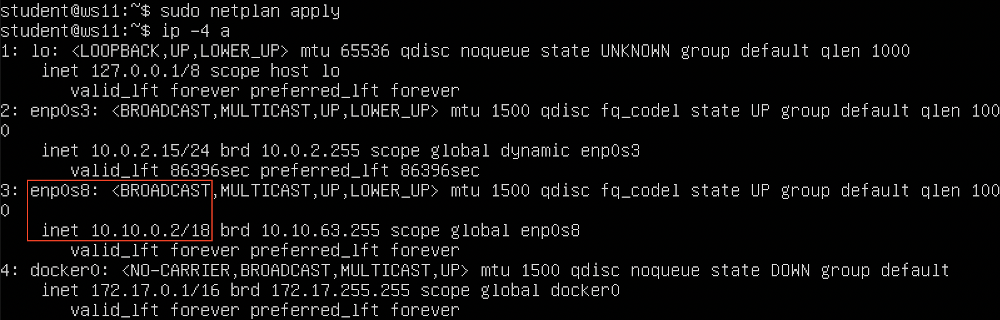
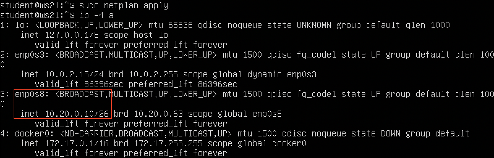
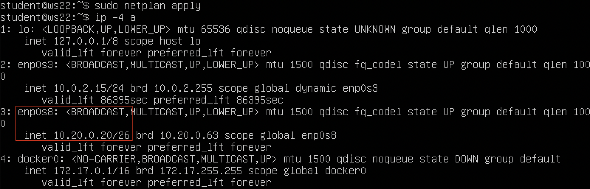

Пропингуем `ws22` с `ws21` с помощью команды

> `ping -c 5 10.20.0.10`

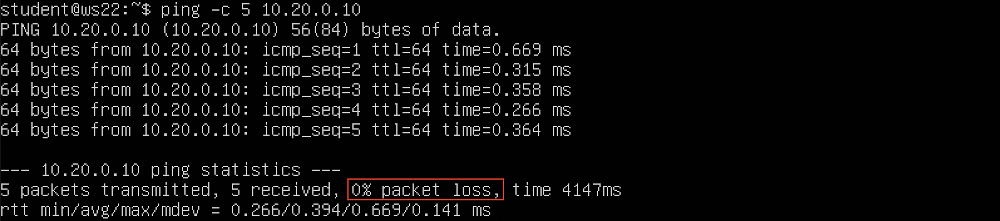

Аналогично пингуем `r1` с `ws11`

> `ping -c 5 10.10.0.2`

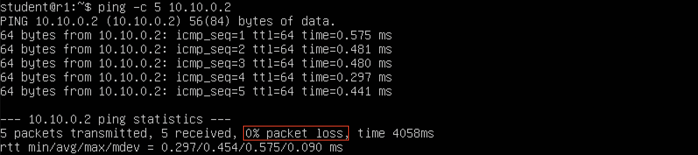

### 5.2. Включение переадресации IP-адресов.

Для включения переадресации IP, выполняем команду на роутерах

> `sudo sysctl -w net.ipv4.ip_forward=1`

Однако при таком подходе переадресация не будет работать после перезагрузки системы.


Откроем файл `/etc/sysctl.conf`

> `sudo nano /etc/sysctl.conf`

Раскомментируем строку `net.ipv4.ip_forward = 1` и сохраним изменения. Теперь IP-переадресация включена на постоянной основе.

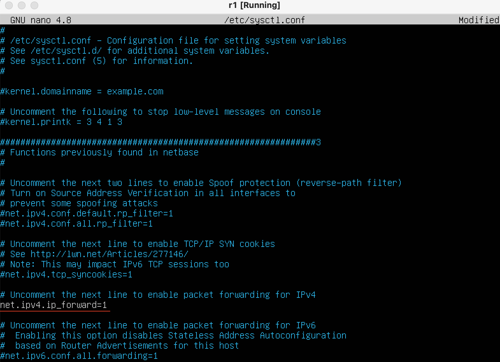
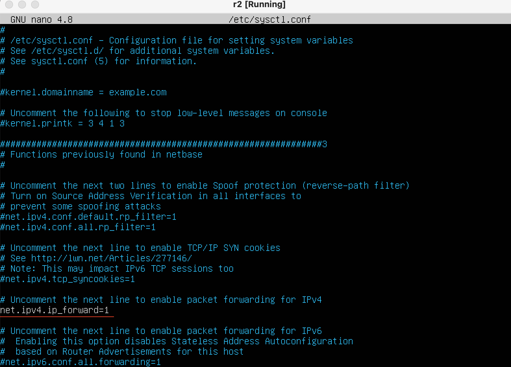

### 5.3. Установка маршрута по-умолчанию

Настраиваем маршрут по-умолчанию (шлюз) для рабочих станций. Для этого добавляем `gateway4: ip роутера` в файле конфигураций `etc/netplan/00-installer-config.yaml`

> `sudo nano /etc/netplan/00-installer-config.yaml`


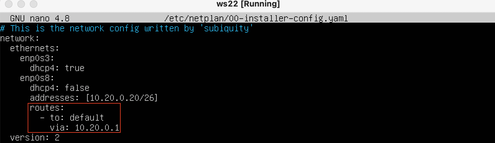

После изменения настроек применяем команду для вступления в силу изменений

> `sudo netplan apply`

Вызовем `ip r`, чтобы показать, что маршрут добавился в таблицу маршрутизации


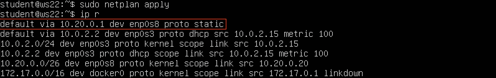

Пропингуем с `ws11` роутер `r2`, пинг не пройдёт, т.к. роутер "не знает" куда вернуть ответ, при этом передача пакетов с машины осуществляется.

Чтобы посмотреть какие девайсы можно прослушать

> `tcpdump -D`

Запускаем на `r2` утилиту `tcpdump`, она позволяет прослушать порты и вывести на экран информацию с каких IP адресов приходят пакеты. В данном случае слушаем интерфейс `enp0s8`

> `tcpdump -tn -i enp0s8`

Сначала на экране r2 будет пусто, идёт ожидание входящих пакетов

Запускаем `ping` на `ws11`

> ` ping -c 5 10.100.0.12`

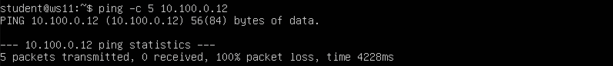

На экране должно `r2` должно появиться


### 5.4. Добавление статических маршрутов

#### 5.4.1 Добавить в роутеры r1 и r2 статические маршруты в файле конфигураций.

Отредактируем файлы конфигураций сети путем изменения содержания файла `etc/netplan/00-installer-config.yaml` для каждого роутера.

> `sudo nano /etc/netplan/00-installer-config.yaml`

Для вступления изменений в силу воспользуемся командой

> `sudo netplan apply`

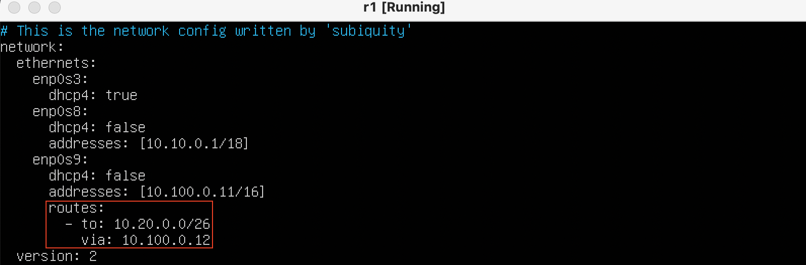
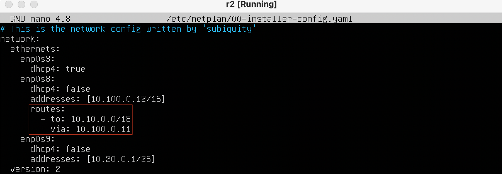

С помощью `ip r` проверяем настройки на роутерах

- 10.20.0.0/26 через 10.100.0.12 устройство enp0s9

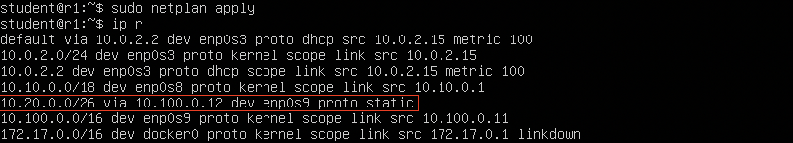

- 10.10.0.0/18 через 10.100.0.11 устройство enp0s8

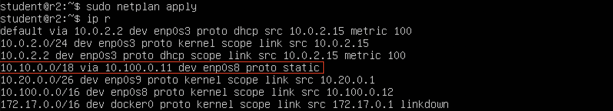

Запустить команды на `ws11`

> `ip r list 10.10.0.0/18`

> `ip r list 0.0.0.0/0`


Для адреса _10.10.0.0/18_ был выбран маршрут, отличный от _0.0.0.0/0_ (он попадает под маршрут по-умолчанию), т.к. машина `ws11` соединена с сетью _10.10.0.0/18_ по своему IP-адресу _10.10.0.2_, для других адресов используется маршрут по умолчанию, который указан в файле _10.10.0.1_.

### 5.5. Построение списка маршрутизаторов

Для установки утилиты на `ws11` используем команду

> `sudo apt install traceroute`

Запустим на `r1` команду дампа

> `tcpdump -tnv -i enp0s8`

- -n - не конвертировать адреса в имена;
- -t - не выводить время при выводе каждой строкчи дампа;
- -v - при синтаксическом анализе и выводить более подробную информацию. Например, печатаются время создания, общая длина и параметры IP-пакета. Также включает дополнительные проверки целостности пакетов, такие как проверка контрольной суммы заголовка IP и ICMP.


При помощи утилиты `traceroute` построим список маршрутизаторов на пути от `ws11` до `ws21`.

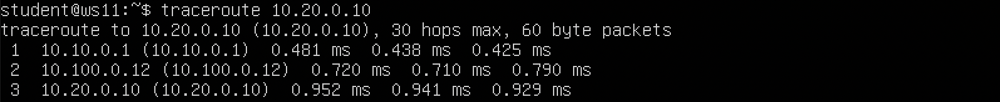

> Каждый пакет проходит на своем пути определенное количество узлов, пока достигнет своей цели. Причем, каждый пакет имеет свое время жизни. Это количество узлов, которые может пройти пакет перед тем, как он будет уничтожен. Этот параметр записывается в заголовке TTL, каждый маршрутизатор, через который будет проходить пакет уменьшает его на единицу. При TTL=0 пакет уничтожается, а отправителю отсылается сообщение Time Exceeded.

> Команда traceroute linux использует UDP пакеты. Она отправляет пакет с TTL=1 и смотрит адрес ответившего узла, дальше TTL=2, TTL=3 и так пока не достигнет цели. Каждый раз отправляется по три пакета и для каждого из них измеряется время прохождения. Пакет отправляется на случайный порт, который, скорее всего, не занят. Когда утилита traceroute получает сообщение от целевого узла о том, что порт недоступен трассировка считается завершенной.

### 5.6. Использование протокола ICMP при маршрутизации

Запустим на `r1` перехват сетевого трафика, проходящего через `enp0s8` с помощью команды

> `sudo tcpdump -n -i enp0s8 icmp`


Пропингуем с `ws11` несуществующий IP (например, 10.30.0.111) с помощью команды

> `ping -c 1 10.30.0.111`


<!-- Сохраняем дампы образов виртуальных машин

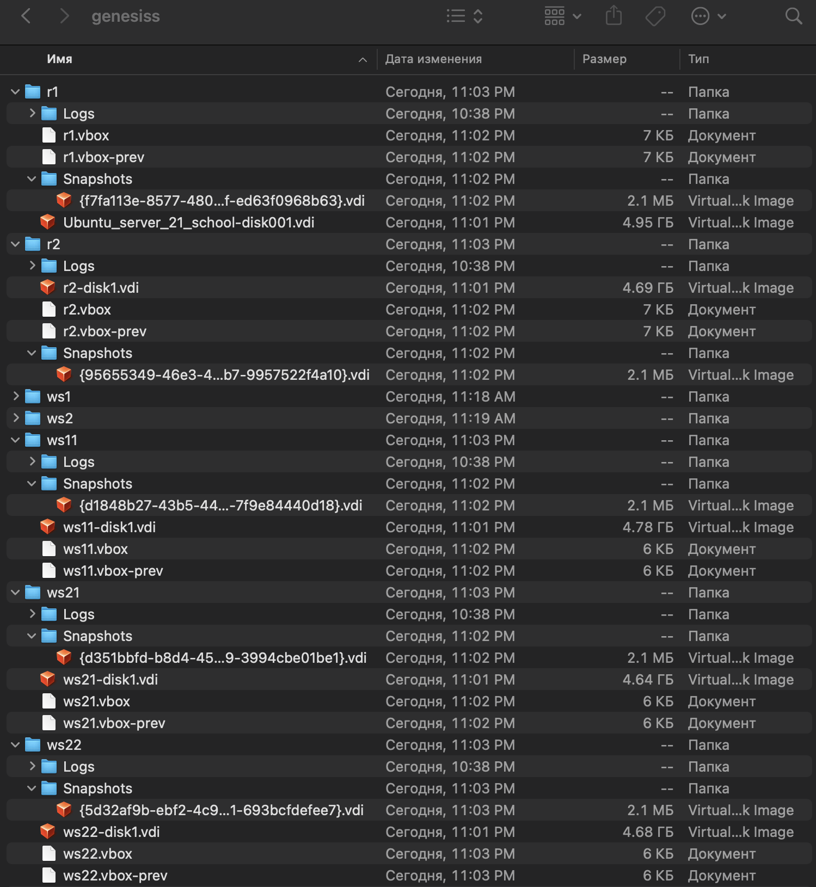 -->

## Part 6. Динамическая настройка IP с помощью DHCP

Прочитать про настройку **DHCP** можно [здесь](https://logi.cc/kaketo-nastrojka-dhcp-servera-na-linux/#.YxLMhtZBzhY 'Настройка DHCP сервера на Linux'), [здесь](https://ixnfo.com/ustanovka-i-nastroyka-isc-dhcp-server-v-ubuntu.html 'Установка и настройка isc-dhcp-server в Ubuntu'), [здесь](https://sysadmin-note.ru/article/ustanovka-i-nastrojka-dhcp-servera-v-ubuntu/ 'Установка и настройка DHCP сервера в Ubuntu') и [здесь](https://help.ubuntu.ru/wiki/%D1%80%D1%83%D0%BA%D0%BE%D0%B2%D0%BE%D0%B4%D1%81%D1%82%D0%B2%D0%BE_%D0%BF%D0%BE_ubuntu_server/%D1%81%D0%B5%D1%82%D1%8C/dhcp 'Протокол динамического выделения адресов (DHCP)
').

### 6.1 Настройка службы DHCP на r2

Если утилита `isc-dhcp-server` ещё не установлена, то файла `/etc/dhcp/dhcpd.conf` ещё не существует в нужном виде. Соотвтетственно для работы с протоколом **DHCP** сначала надо установить эту утилиту

> `sudo apt-get install isc-dhcp-server`

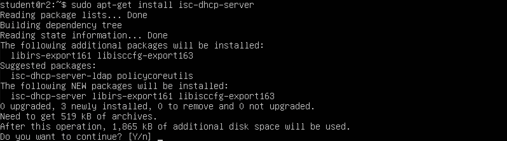
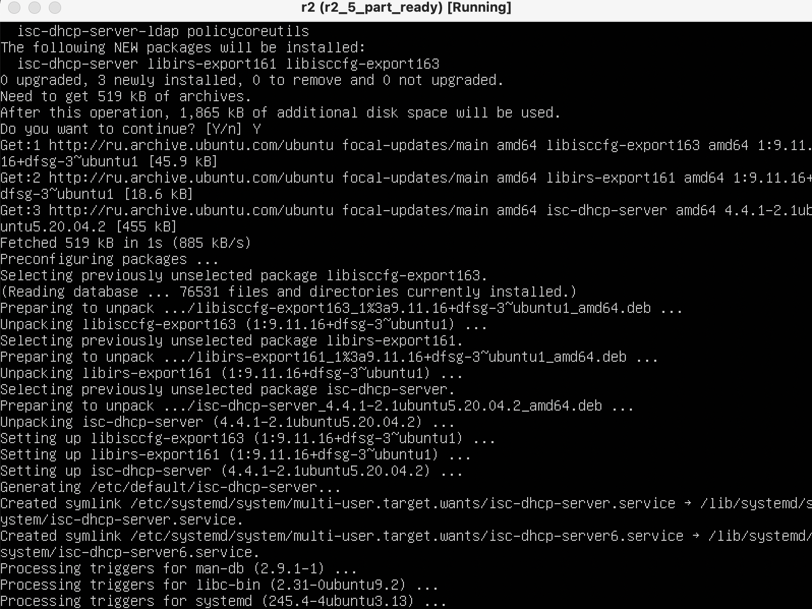

Теперь для **r2** можем настроить в файле `/etc/dhcp/dhcpd.conf` конфигурацию службы `DHCP`

1. указываем адрес маршрутизатора по-умолчанию, DNS-сервер и адрес внутренней сети.

Открываем файл `/etc/dhcp/dhcpd.conf` для редактирования

> `sudo nano /etc/dhcp/dhcpd.conf`

Так выглядит только что открытый файл `dhcpd.conf`

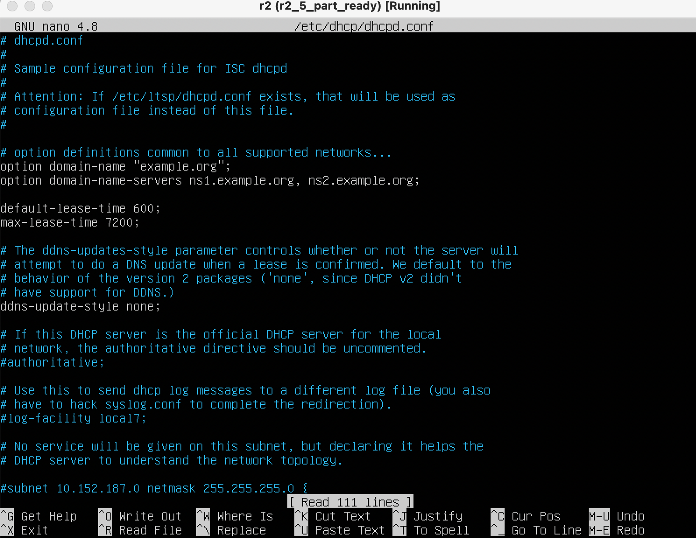
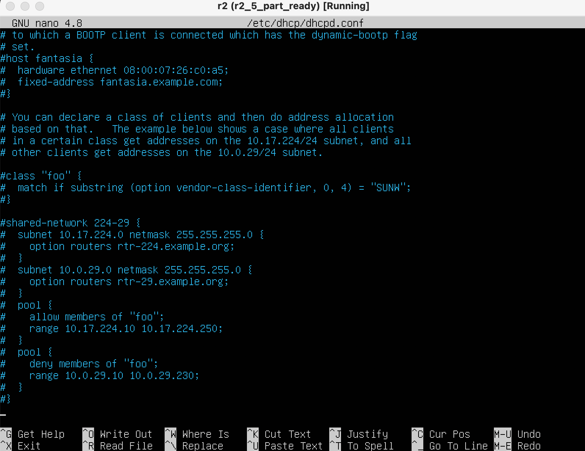

Вносим изменения

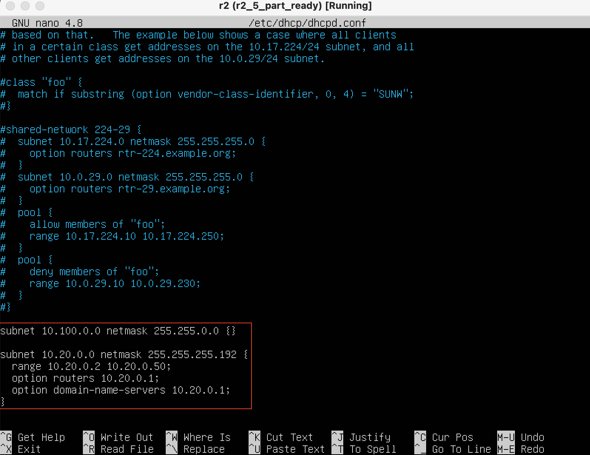

2. в файле `/etc/resolv.conf`(содержит адреса серверов имен, к которым имеет доступ данная система) прописываем `nameserver 8.8.8.8`

> `sudo nano /etc/resolv.conf`

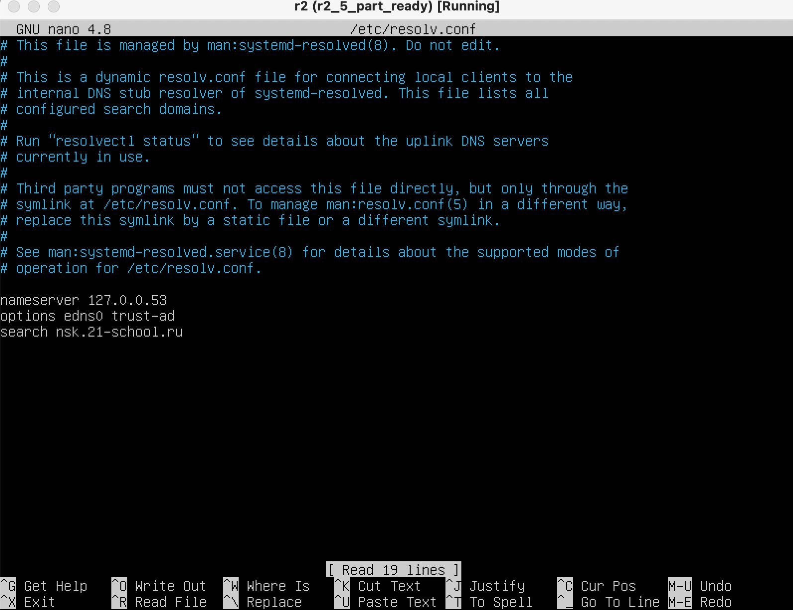


Перезагрузим службу **DHCP**

> `systemctl restart isc-dhcp-server`


Можно проверить статус службы

> `sudo systemctl status isc-dhcp-server`

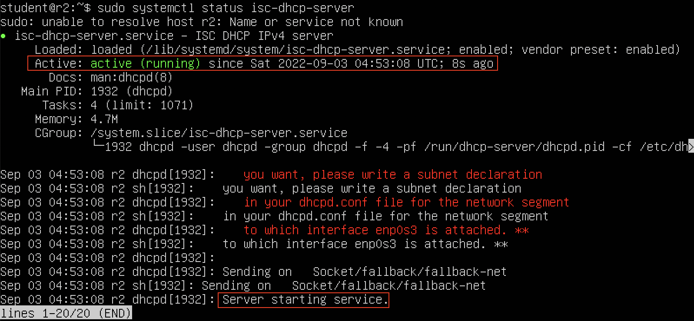

Изменим настройки машин **ws21** и **ws22** в файле конфигурации, чтобы сделать протокол **DHCP** активным. На каждой машине введём

> `sudo nano /etc/netplan/00-installer-config.yaml`

> `sudo netplan apply`

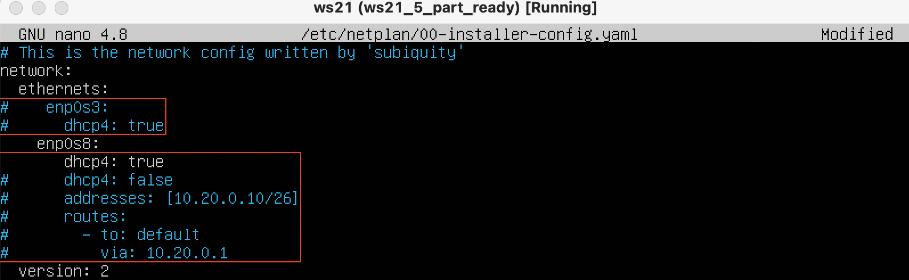
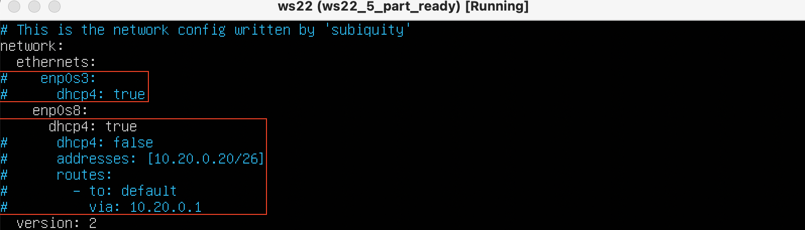

Перезагружаем виртуальную машину **ws21**

> `sudo systemctl reboot`

Проверяем присвоенный устройствам адрес

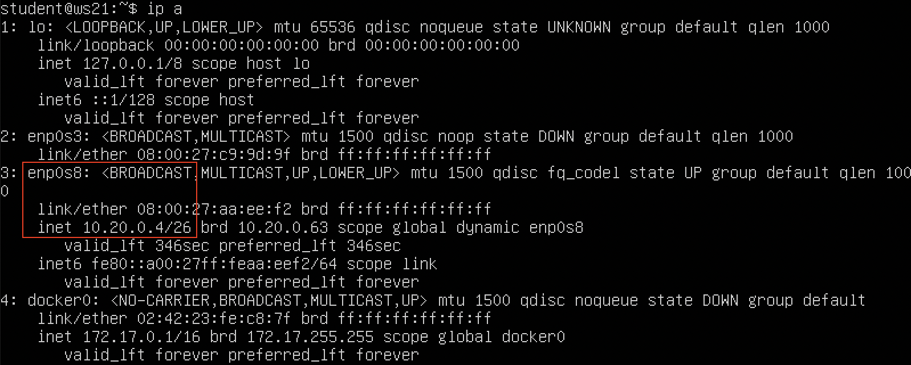


Проверим соединение машины **ws22** с **ws21**

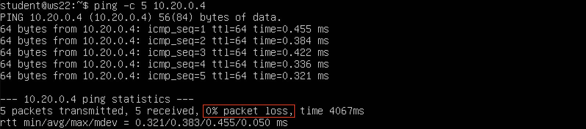

### 6.2 Указать MAC-адреса

Чтобы указать MAC-адрес у **ws11**, в файл `etc/netplan/00-installer-config.yaml` надо добавить строки: `macaddress: 10:10:10:10:10:BA`, `dhcp4: true`

> `sudo nano /etc/netplan/00-installer-config.yaml`

> `sudo netplan apply`

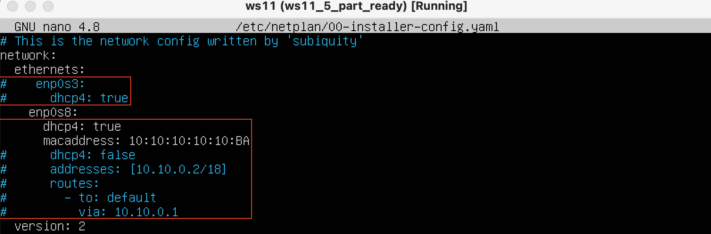

[Выключаем](https://losst.ru/vyklyuchenie-linux-iz-komandnoj-stroki 'Выключение LINUX из командной строки') машину **ws11**

> ` sudo shutdown -h now`

Заходим в менеджер виртуальных машин VirtualBox и там настраиваем **ws11** MAC-адрес

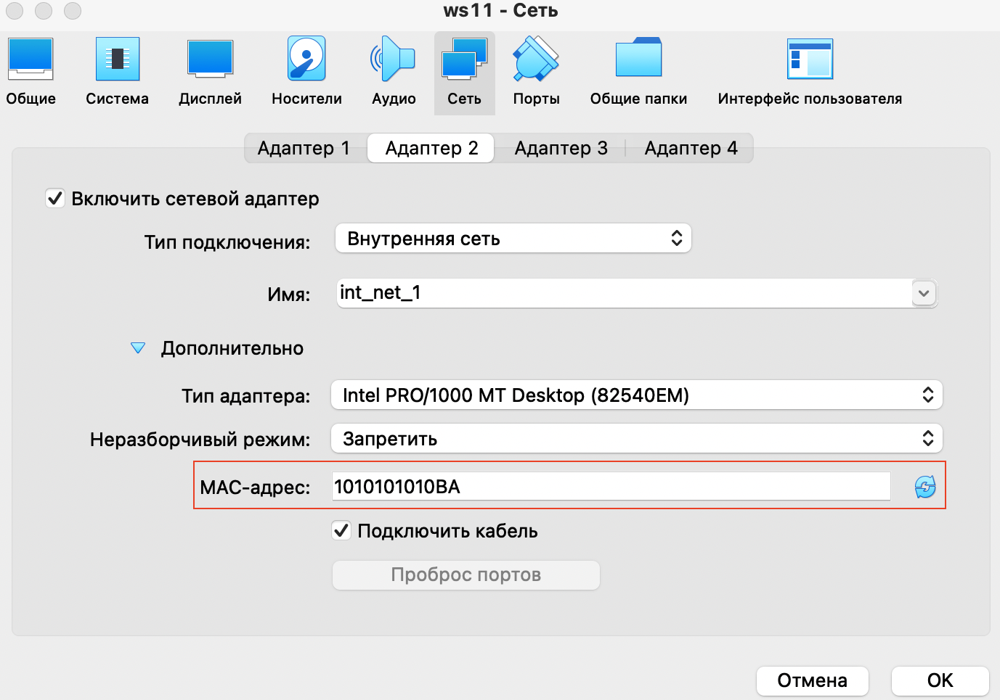

Для **r1** настроим аналогично **r2**, но выдачу адресов сделаем с жесткой привязкой к MAC-адресу (**ws11**).

> `sudo apt-get install isc-dhcp-server`

> `sudo nano /etc/dhcp/dhcpd.conf`

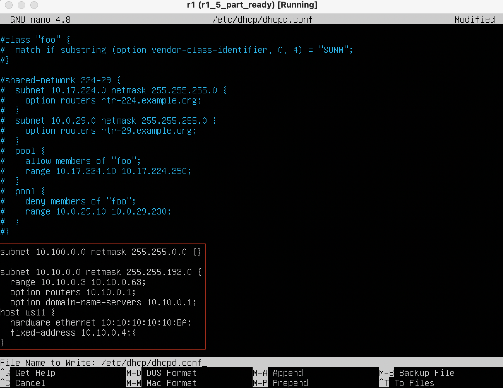

> `sudo nano /etc/resolv.conf`

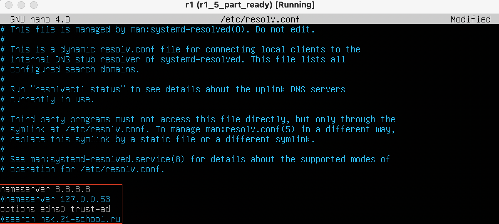

> `systemctl restart isc-dhcp-server`


> `sudo systemctl status isc-dhcp-server`

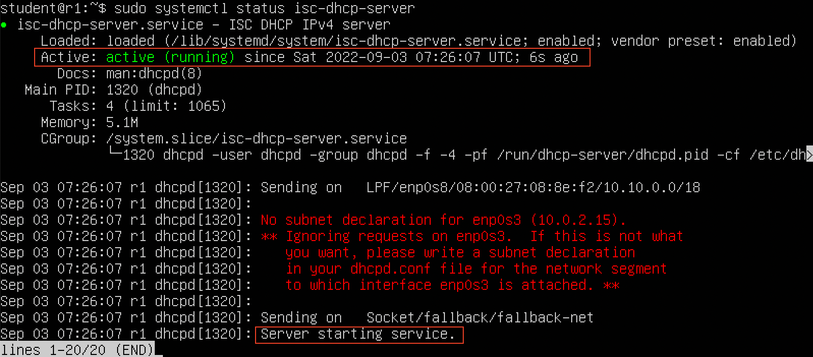

Проводим аналогичные тесты - смотрим какой адрес назначен машине **ws11**

> `ip a`

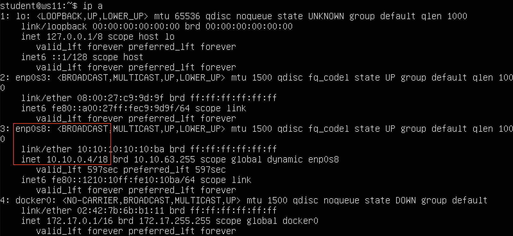

Пропингуем соединение

> `ping -c 5 10.10.0.4`

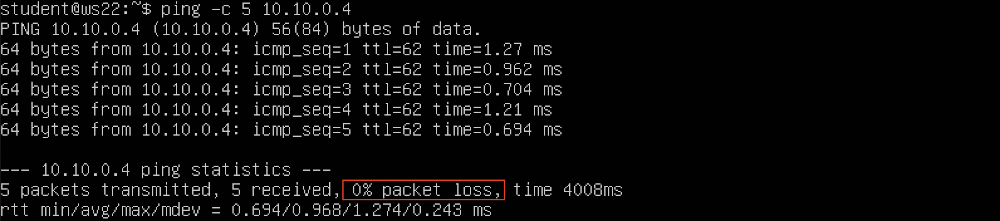

### 6.3 Обновление ip адреса с помощью команды _sudo dhclient_.

Проверяем IP до обновления

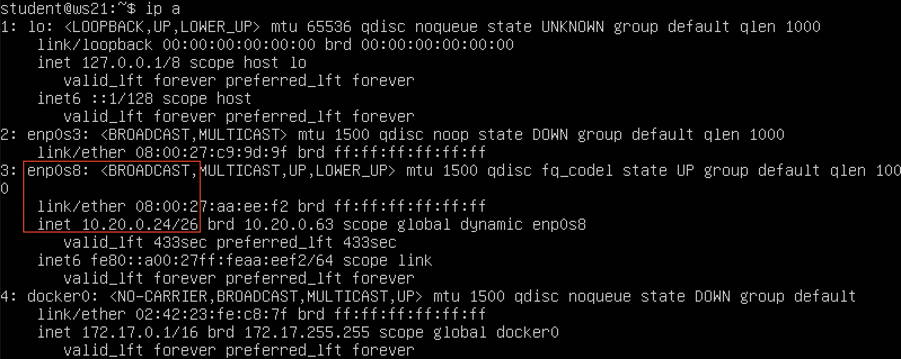

Запросим с **ws21** обновление ip адреса с помощью команды

> `sudo dhclient -v`

- `-v` - будет выведена дополнительная информация.


> `ip a`


Выполним команду для удаления старого IP адреса

> `sudo dhclient -r`

- `-r` - явно освобождает текущую аренду ip адреса.


Чтобы обновить или освободить IP-адрес для конкретного интерфейса, например, eth0, необходимо ввести:

> `sudo dhclient -r eth0`

> `sudo dhclient eth0`

Проверим IP адреса

> `ip a`


> В части 6 были использованы следующие опции **DHCP** протокола:
>
> - option routers _ip-address [, ip-address...];_ - адреса шлюзов для клиентской сети. Маршрутизаторы должны быть перечислены в порядке предпочтительности.
> - option domain-name-servers _ip-address [, ip-address...];_ - Список DNS серверов доступных клиенту. Сервера должны быть перечислены в порядке предпочтительности.

<!-- Сохраняем дампы образов виртуальных машин.

 -->

## Part 7. NAT

Для работы с сервером `apache2`, установим его на машины `r1`, `r2` и `ws22`. Возможно `apache2` не будет устанавливаться, тогда возможно поможет обновление системы (см. ниже).

> `sudo apt install apache2`

Обновление системы

> `sudo apt update`

> `sudo apt upgrade -y`

- `-y` - при запросе сразу согласиться с установкой.

### 7.1 Делаем сервер Apache2 общедоступным.

В файле `/etc/apache2/ports.conf` на `ws22` и `r2` меняем строку `Listen 80` на `Listen 0.0.0.0:80`.

> `sudo nano /etc/apache2/ports.conf`


Запустить веб-сервер **Apache** командой на `ws22` и `r1`

> `service apache2 start`


### 7.2 Создаем фаервол на r2 [(как в части 4)](#41-утилита-iptables). Следующие правила:

1. Удаление правил в таблице filter - `iptables -F`
2. Удаление правил в таблице "NAT" - `iptables -F -t nat`
3. Отбрасывать все маршрутизируемые пакеты - `iptables --policy FORWARD DROP`


Запустим файлы на обеих машинах командами

> `sudo chmod +x /etc/firewall.sh`

> `sudo bash /etc/firewall.sh`


При запуске файла `firewall.sh` с этими правилами, `ws22` не должна "пинговаться" с `r1`.

Проверяем соединение между `r1` и `ws22`

> `ping -c 5 10.20.0.20`


Проверяем соединение между `ws22` и `r1`

> `ping -c 5 10.100.0.11`


4. Разрешить маршрутизацию всех пакетов протокола ICMP, для этого прописываем правило для протокола _icmp_ и цепочки _FORWARD_

> `sudo nano /etc/apache2/ports.conf`


Теперь при запуске файла `firewall.sh` с этими правилами, `ws22` должна "пинговаться" с `r1`

Проверяем соединение между `r1` и `ws22`

> `ping -c 5 10.20.0.20`


Проверяем соединение между `ws22` и `r1`

> `ping -c 5 10.100.0.11`


Добавляем в файл ещё два правила:

5. Включаем **SNAT**, а именно маскирование всех локальных ip из локальной сети, находящейся за `r2` (по обозначениям из Части 5 - сеть 10.20.0.0)

6. Включаем **DNAT** на 8080 порт машины `r2` и добавим к веб-серверу Apache, запущенному на `ws22`, доступ извне сети

> `sudo nano /etc/apache2/ports.conf`


> Значения использованных опций:
>
> - `t` - указывает на используемую таблицу;
> - `p` - указывает протокол, такие как tcp, udp, udplite и другие, поддерживаемые системой, ознакомиться со списком можно в файле `/etc/protocols`;
> - `m` - подключает указанный модуль;
> - `s` - указывает адрес источника пакета, в качестве значения можно указать как один IP-адрес, так и диапазон;
> - `i` - задает входящий сетевой интерфейс;
> - `o` - указывает исходящий сетевой интерфейс;
> - `--dport` - порт получателя пакета;
> - `DNAT` — подменяет адрес получателя в заголовке IP-пакета, основное применение — предоставление доступа к сервисам снаружи, находящимся внутри сети;
> - `SNAT` — служит для преобразования сетевых адресов, применимо, когда за сервером находятся машины, которым необходимо предоставить доступ в Интернет, при этом от провайдера имеется статический IP-адрес.

#### SNAT и DNAT

**NAT** — это аббревиатура для преобразования сетевых адресов.
[NAT](https://habr.com/ru/post/583172/ 'NAT (Network Address Translation) для новичков') возникает при изменении одного из IP-адресов в заголовке IP-пакета, т. е. IP-адреса источника (source-addr) или IP-адреса назначения (dest-addr).


| ПАРАМЕТР               | **SNАТ**                                                                                                                                                                                                                  | **DNAT**                                                                                                                                                                                                                                                                               |
| ---------------------- | ------------------------------------------------------------------------------------------------------------------------------------------------------------------------------------------------------------------------- | -------------------------------------------------------------------------------------------------------------------------------------------------------------------------------------------------------------------------------------------------------------------------------------- |
| Аббревиатура           | источник **NAT**                                                                                                                                                                                                          | назначение **NAT**                                                                                                                                                                                                                                                                     |
| Терминология           | **SNAT** изменяет частный IP-адрес исходного хоста на общедоступный IP-адрес. Он также может изменить исходный порт в заголовках TCP/UDP. **SNAT** обычно используется внутренними пользователями для доступа в Интернет. | Назначение **NAT** изменяет адрес назначения в IP-заголовке пакета. Он также может изменить порт назначения в заголовках TCP/UDP. **DNAT** используется, когда нам нужно перенаправить входящие пакеты с общедоступным адресом/портом на частный IP-адрес/порт внутри внутренней сети. |
| Пример использования   | Клиент внутри локальной сети и за брандмауэром хотел просматривать Интернет                                                                                                                                               | Веб-сайт, размещенный в центре обработки данных за брандмауэром, и должен быть доступен для пользователей через Интернет                                                                                                                                                               |
| Изменение адреса       | **SNAT** изменяет адрес источника пакетов, проходящих через устройство **NAT**                                                                                                                                            | **DNAT** изменяет адрес назначения пакетов, проходящих через маршрутизатор.                                                                                                                                                                                                            |
| Порядок работы         | **SNAT** выполняется после принятия решения о маршрутизации.                                                                                                                                                              | **DNAT** выполняется до принятия решения о маршрутизации.                                                                                                                                                                                                                              |
| Коммуникационный поток | Когда внутренняя защищённая сеть инициирует связь с внешним миром, происходит **SNAT**                                                                                                                                    | Когда внешняя незащищенная сеть инициирует связь с внутренней защищенной сетью, происходит **DNAT**.                                                                                                                                                                                   |
| Один/несколько хостов  | **SNAT** позволяет использовать несколько хостов во «внутренней» сети для доступа к любому хосту во «внешней» сети                                                                                                        | **DNAT** позволяет любому хосту во «внешней» сети получить доступ к одному хосту во «внутренней» сети                                                                                                                                                                                  |

Запускаем файл также, как в Части 4 (перед тестированием отключим сетевой интерфейс **NAT** (его наличие можно проверить командой `ip a`) в VirtualBox, если он включен)


Проверяем соединение по TCP для SNAT, для этого с `ws22` подключаемся к серверу Apache на `r1` командой `telnet [адрес] [порт]`

> `telnet 10.100.0.11 80`


Проверить подмену IP-адреса можно с помощью команды `tcpdump` - пингуем с машины `ws22` роутер `r1`, в выводе `tcpdump` будет отображаться с какого адреса идет запрос - IP-адрес `r2`


Проверяем соединение по TCP для DNAT, для этого с `r1` подключаемся к серверу Apache на `ws22` (обращаться по адресу `r2` и порту 8080)

> `telnet 10.100.0.12 8080`


При этой проверке следует отключить на `ws22` автоматическую выдачу ip `enp0s3`

> `sudo tcpdump -i enp0s8`

<!-- 

<!-- Сохраняем дампы образов виртуальных машин -->

 -->

## Part 8. Дополнительно. Знакомство с SSH Tunnels

Прочитать о основных возможностях SSH Tunnels можно [здесь](https://habr.com/ru/post/331348/ 'Магия SSH'). [Статья 1](https://selectel.ru/blog/ssh-tunnels/ 'SSH-туннели: практические примеры использования и важные функции'), [статья 2](https://habr.com/ru/post/435546/ 'Практические советы, примеры и туннели SSH'), [статья 3](https://habr.com/ru/post/122445/ 'Памятка пользователям ssh').

Запускаем виртуальные машины со следующими настройками


Скорее всего на нужных машинах `apache2` не стоит и его нужно установить. Однако перед установкой желательно обновить систему

> `sudo apt update`

> `sudo apt upgrade -y`

- `-y` - при запросе сразу согласиться с установкой.

Устанавливаем `apache2`

> `sudo apt install apache2`

Запускаем веб-сервер `Apache` на `ws22` только на `localhost` (то есть в файле `/etc/apache2/ports.conf` изменить строку `Listen 80` на `Listen localhost:80`)

> `sudo nano /etc/apache2/ports.conf`

**1)** Воспользуемся `Local TCP forwarding` с `ws21` до `ws22`, чтобы получить доступ к веб-серверу на `ws22` с `ws21`

Переадресация локального порта позволяет перенаправить порт на локальном компьютере (клиент ssh) на порт на удаленном компьютере (сервер ssh), который затем перенаправляется на порт на компьютере назначения.
В этом типе переадресации клиент SSH прослушивает заданный порт и туннелирует любое подключение к этому порту к указанному порту на удаленном сервере SSH, который затем подключается к порту на целевом компьютере. Конечным компьютером может быть удаленный SSH-сервер или любой другой компьютер.

Пробрасывать порт от сервера будем по следующему алгоритму:

1. На машине `ws22`: создадим соединение с машины `ws22`, на которой установлен сервер `ssh`, с машиной `ws 21`.
2. На машине `ws22`: с помощью команды `ssh -L` прокинем "прямое" соединение с машины `ws21` на машину `ws22`.

Для [контроля процессов соединей](https://btip.ru/kak-vyjti-iz-sistemy-ssh-soedineniya-drugih-polzovatelej-s-pomoshhyu-komandnoj-stroki-v-mac-os-ili-linux/ 'Как выйти из системы ssh-соединения других пользователей с помощью командной строки в Mac OS или Linux') на запущенной машине с сервером `apache2`, проверим процессы с именем `sshd`

> `ps aux | grep sshd`

Здесь все процессы `sshd` которые запущены до момента создания ssh-туннеля на машине `ws22`


Создаём соединение. Запускаем на машине `ws22`

> `ssh 10.20.0.20`


Оставаясь на машине `ws22`, устанавливаем соединение с сервером `ws22` от машины `ws21`

> `ssh -L 8080:127.0.0.1:80 10.20.0.20`


Проверяем процессы на машине `ws22` после создания соединения

> `ps aux | grep sshd`


На машине `ws21` запускаем утилиту `telnet`

> `telnet 127.0.0.1 8080`


Проверяем запущенные процессы на машине `ws21` и "убиваем" процесс отвечающий за соединение с сервером

> `ps aux | grep sshd`


Когда процесс, на машине `ws21`, отвечающий за соединение, будет "убит", появится сообщение на машине `ws22`


**2)** Воспользоваться `Remote TCP forwarding` c `ws11` до `ws22`, чтобы получить доступ к веб-серверу на `ws22` с `ws11`.

Переадресация удаленного порта противоположна переадресации локального порта. Это позволяет перенаправить порт на удалённом компьютере (сервер ssh) на порт на локальном компьютере (клиент ssh), который затем перенаправляется на порт на компьютере назначения.
В этом типе переадресации сервер SSH прослушивает заданный порт и туннелирует любое соединение с этим портом на указанный порт локального клиента SSH, который затем подключается к порту на целевом компьютере. Машина назначения может быть локальной или любой другой машиной. Удаленное перенаправление портов в основном используется для предоставления доступа к внутренней службе кому-то извне.

Из-за того что на роутере `r2` настроен firewall, подключиться к серверу Apache на машине `ws22` с помощью команды `ssh -L`, с машины `ws11`, не получится (роутер `r2` не пропустит команду). В этом случае необходимо воспользоваться командой `ssh -R`. Выполнить её необходимо на машине `ws22`. Это выполняется за несколько шагов:

1. На машине `ws11`: На машине `ws11`: переход с машины `ws11` на роутер `r2` с помощью `ssh` (роутер не позволит сразу перейти на машину `ws22`);
2. На машине `ws11`: переход с роутера `r2` на машину `ws22` с помощью `ssh`;
3. На машине `ws11`: проброс туннеля с машины `ws22` на машину `ws11` с помощью `ssh -R`;

Описание команды:

> `ssh -R [удаленный_адрес:]удаленный_порт:локальный_адрес:локальный_порт [пользователь@]сервер`

Пробрасываем маршрут. Запускаем с машины `ws11` команду.

> `ssh 10.100.0.12`

Благодаря этой команде находясь на машине `ws11` можно увидить следующую картину, в которой изменится хост текущей машины на `r2`


Далее находясь физически на той же машине `ws11` с именем хоста `r2`, вводим следующую команду

> `ssh 10.20.0.20`

Находясь на машине `ws11`, получим следующий результат `r2` -> `ws22`


В предыдущей части на роутере `r2` был настроен на `fireWall`, который не пропускает проходящие пакеты из другой сети. Поэтому сначала необходимо пробросить тунель от `ws22` к `ws11`. Для этого запускаем на машине `ws11` команду

> `ssh -R 10.10.0.2:8080:127.0.0.1:80 10.10.0.2`


Для проверки, сработало ли подключение, переходим во второй терминал (для этого находясь в терминале машины `ws11` нажимаем `option + fn + F2` или `Alt + F2`) и выполяем команду (`telnet 127.0.0.1 [локальный порт]`). В момент выполнения данной команды необходимо нажать любую клавишу

> `telnet 127.0.0.1 8080`


